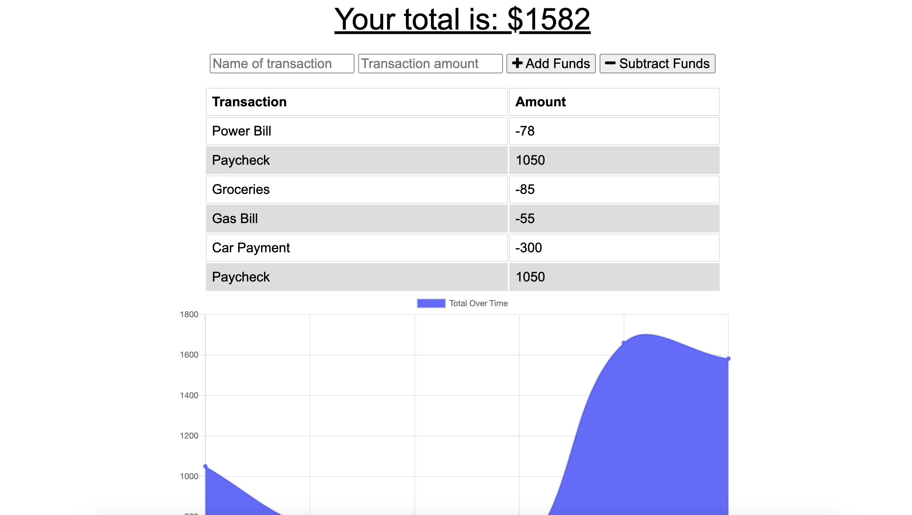

# budget-tracker

 ## Description
  This app helps you track your money and help you budget.  You can add deposits and substract your expenses.  This app has the ability to run offline with the help of IndexDB and Service Workers.  It is also a PWA (Progressive Web Application), so the user is able to install the app directly to their device.

  ## Installation
  To run the app locally, you will need to install required dependecies, by using: 
  `npm install` 

  ## Usage
  The site is deployed using Heroku and MongoDB Atlas. <a href="https://pure-basin-22816.herokuapp.com">Here is the deployed site.</a>  
  To run the app locally, go to the command line and enter: `npm start`  Then head to your browser and view the app at "http://localhost:3001/"
  

  
  

 ## Built With
 This application is built with:  
 * Express.js
 * MongoDB
 * Mongoose
 * IndexDB
 * Service Workers
 * PWA

  ## Questions
  If you have any questions, please reach out on <a href="https://github.com/sacylkowski/">GitHub</a> or you can <a href="mailto:sacylkowski@gmail.com">E-mail me</a>.

